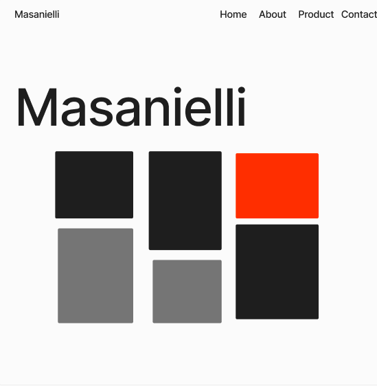
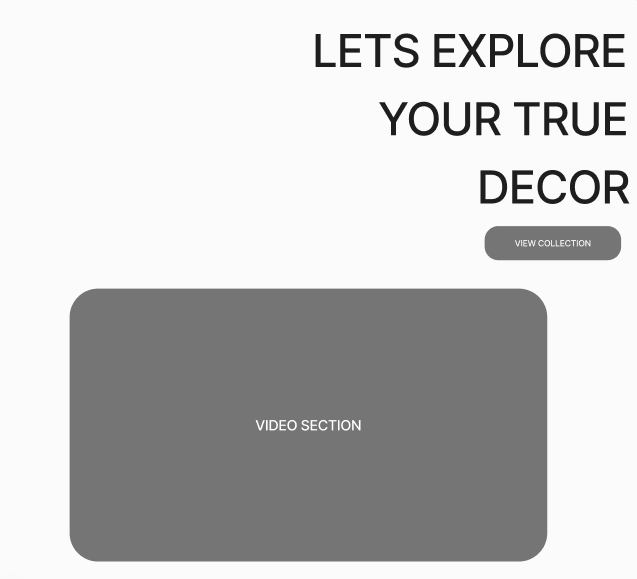
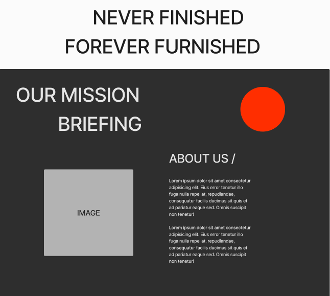

# my veryfirst website

# 1. Project Overview

## 1.1. Project Objective

The primary objective of the project is to showcase handcrafted furniture, customized specifically for each individual that is then made available for purchase. 

The user can browse the selection and then enquire about getting either there own piece made or select from some of the designs alreadly available. The user is left to feel uniquely targted opposed to just buying from any normal retailer.

The target audience are people with a keen eye for detail and appreciation for owning a one of kind artistic piece.

## User Stories

First time users
As a first time visitor I want to know what the website is about.
As a first time visitor I want to know how I can enquire about a product.
As a first time visitor I want to know what the website offers.
As a first time visitor I want to browse what type of products they make to determine if this is right for me.
As a first time visitor I want to check know about social media profiles to see what the company is about and what others have to say.
Returning users
As a returning visitor I want to see if the company still upholds its reputation.
As a returning visitor I want to see if there are any changes to the services.
As a returning visitor I want to send a message to give a feedback.
As a returning visitor I want to know if there any comminuty links.
Site owner
As a site owner I want to promote my products for the best chance of selling the products.
As a site owner I want to provide more information about custom bespoke furniture and why people should opt to purchase.
As a site owner I want to provide a way for people to get in contact and also share their experience with other potential customers.

## Design

The colours I chose to use where neutral off white's and charchoal grey's aswell as a bright vibrant red which pops out from the neutral theme.
I did this as I felt it provided a clean, minimalistic and contempory feel, whils't allowing the beauty of the products to take center stage.

When it came to typography the Poppins font is the main font I used throughout website.
Poppins is a clean font I see throughout web design and this is the primary reason I chose to use it
I combine this with Sans Serif, as I really enjoy the simplicty it has, not only that but in some case where the other font isn't being imported it will not detract from the integrity of the design. 

This minimalist approach was important as to give a proffesional apperance and the images used are a design statement themsleves.
I caught the users eye with a bold typogrpahic company logo aswell as grid style hero layout with images of the products which the user enages with instantly.

I saw this as good design choice as any potential customer will see what is offer as soon as the page loads.

    
Home Page

    

    
Second Section

    

    
About Section

    

