# my veryfirst website

[Visit the live webpage](https://arts-ux.github.io/furniture-store/)

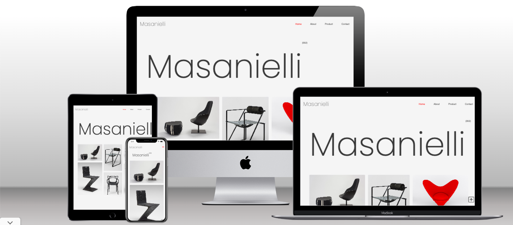

# 1. Project Overview

## 1.1. Project Objective

The primary objective of the project is to showcase handcrafted furniture, customized specifically for each individual that is then made available for purchase. 

The user can browse the selection and then enquire about getting either there own piece made or select from some of the designs alreadly available. The user is left to feel uniquely targted opposed to just buying from any normal retailer.

The target audience are people with a keen eye for detail and appreciation for owning a one of kind artistic piece.

## User Stories

First time users
As a first time visitor I want to know what the website is about.
As a first time visitor I want to know how I can enquire about a product.
As a first time visitor I want to know what the website offers.
As a first time visitor I want to browse what type of products they make to determine if this is right for me.
As a first time visitor I want to check know about social media profiles to see what the company is about and what others have to say.
Returning users
As a returning visitor I want to see if the company still upholds its reputation.
As a returning visitor I want to see if there are any changes to the services.
As a returning visitor I want to send a message to give a feedback.
As a returning visitor I want to know if there any comminuty links.
Site owner
As a site owner I want to promote my products for the best chance of selling the products.
As a site owner I want to provide more information about custom bespoke furniture and why people should opt to purchase.
As a site owner I want to provide a way for people to get in contact and also share their experience with other potential customers.

## Design

The colours I chose to use where neutral off white's and charchoal grey's aswell as a bright vibrant red which pops out from the neutral theme.
I did this as I felt it provided a clean, minimalistic and contempory feel, whils't allowing the beauty of the products to take center stage.

When it came to typography the Poppins font is the main font I used throughout website.
Poppins is a clean font I see throughout web design and this is the primary reason I chose to use it
I combine this with Sans Serif, as I really enjoy the simplicty it has, not only that but in some case where the other font isn't being imported it will not detract from the integrity of the design. 

This minimalist approach was important as to give a proffesional apperance and the images used are a design statement themsleves.
I caught the users eye with a bold typogrpahic company logo aswell as grid style hero layout with images of the products which the user enages with instantly.

I saw this as good design choice as any potential customer will see what is offer as soon as the page loads.

    
Home Page

    

    
Second Section

    

    
About Section

    

## Features

The website consists on a main home page with an about section and 3 form pages for the website services (Products/Contact/404 error).

## Header & Navigation

The header is displayed across all pages except the 404 error page. It contains a logo to the left, a title and navigation menu. The navigation menu on the home page contains links to all sections in the page.

In mobiles the navigation turns into a drop down with a hamburger menu.

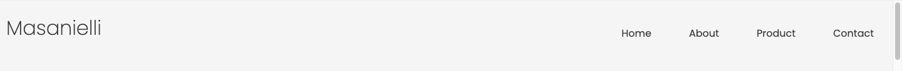

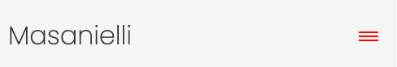

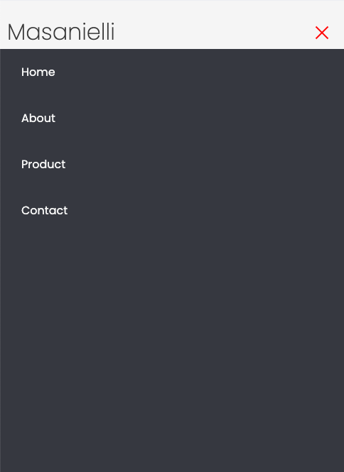

## Hero Section

The hero section displays a large version of the company logo as well an artiscally presented array of images showcasing some of the products in a grid-like format. This is so the user gets a visual representaion of what the site offers and at the same time providing a proffesional apperance.

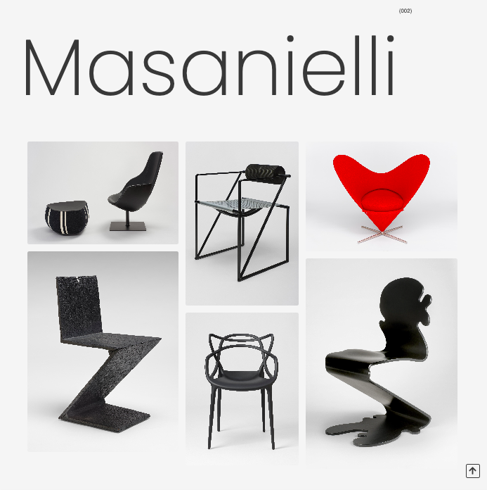

## Second Page & Video Section

The second page contains a slogan that has an effect when scrolled to captivate the user and a call to action button that re-directs them to product page.

Upon further scrolling a video of a showroom with furniture is presented which has more to do with aesthics and what a home could look like with these products inside rarther than any other purpose.

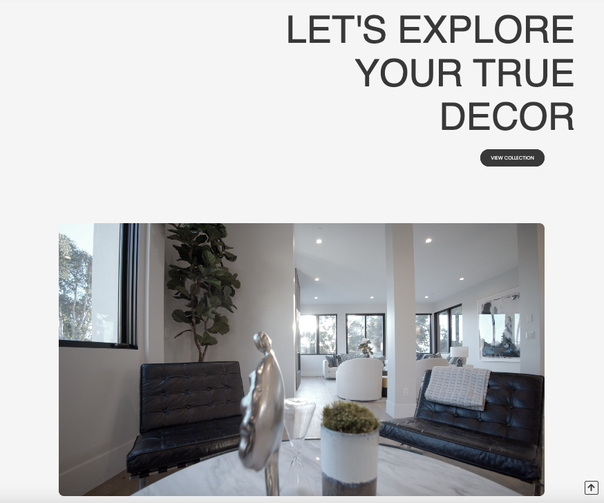

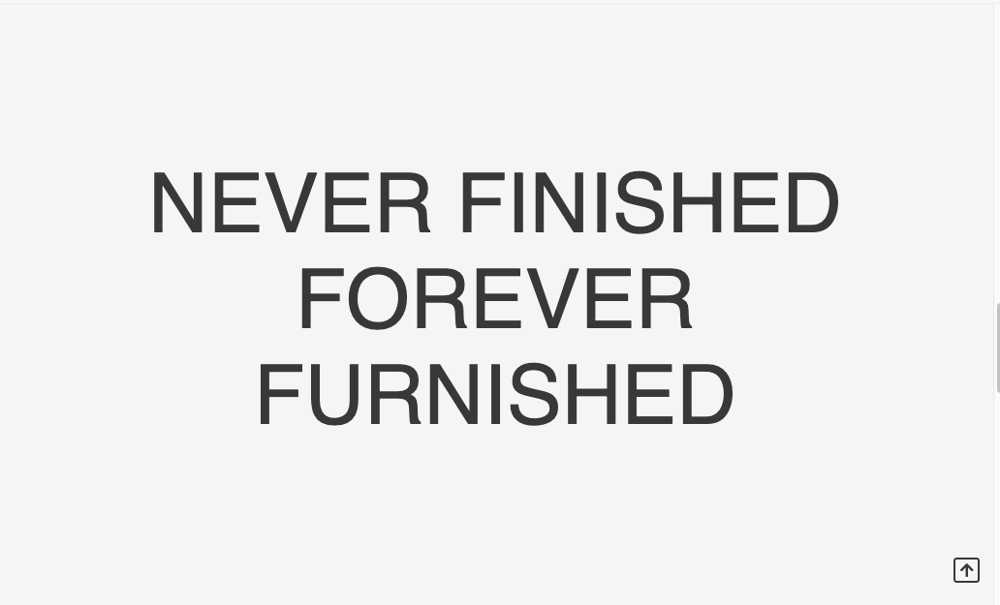

## About Us Secion

The about us section decribes what it is we do as well a detailed history of the people and the company website.

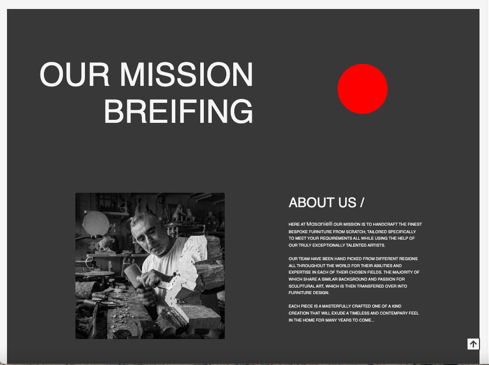

## 2.5 Footer & Social Media links

The footer containes a link to the homepage of the social media platforms aswell links to homepage, our services, terms and privacy policy. Three of those links are inactive, which when clicked wel re-direct you to the 404 error page where the user can click a link returning you back to the homepage. Currently the the links that users to the home page of the social media still don't have any social media profiles.

The logo image was also added to the footer (which again returns the user back to the homepage).

## Product Page

The prodocut pages contains a well laid out structure of images that display each product aswell as the product name, designer and prices.

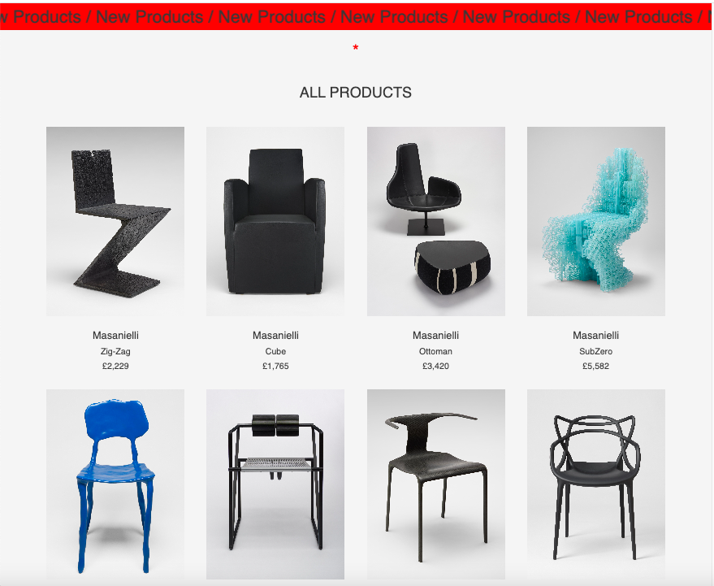

## Contact Form

The Contact form is a page where the user can send the site owner a feedback, how to enquire about a personalized piece or request any aditional information they might potentially need.

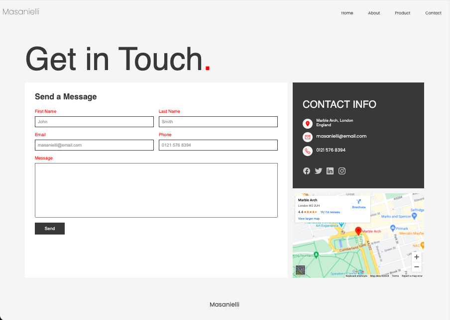

## Error 404 Page

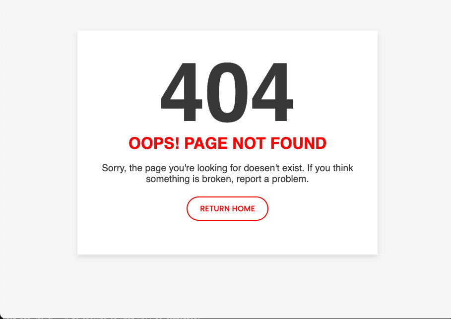

The Error Page contains a 404 message that shows the page they were looking for could not be found and a button which then re-directs them back to the homepage.

## HTML Validator

### Home Page

### Product Page

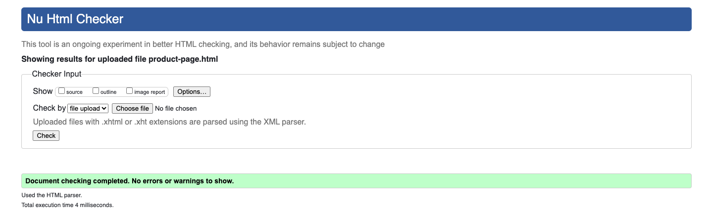

### Contact Page

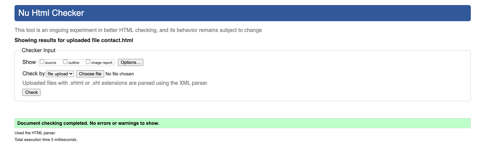

### 404 Error Page

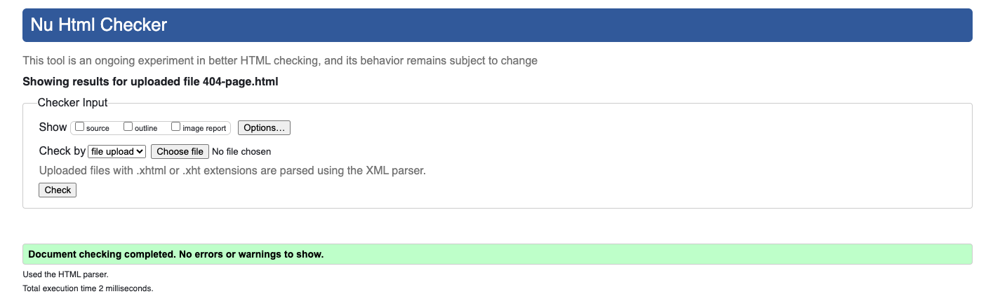

## 3.2. CSS Validator

For validating the CSS, the style.css file was uploaded to the W3C Jigsaw Validation service. It indicated  no errors and the CSS code passed validation.

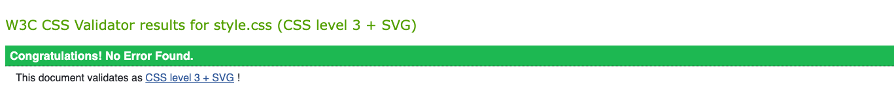

## Deployment

The website was developed using VSCode and deployed through GitHub Pages.
For deploying on GitHub Pages the following actions were taken:

1. Navigate to the repository in GitHub
2. Select the Settings tab
3. On the left navigation menu, under Code and Automation, select Pages
4. Select Deploy from a branch under source
5. Select the main branch
6. After the page reloads, the link to the deployed page then showed up at the top.

You can see the GitHub repository by clicking [here](https://github.com/arts-ux/furniture-store).