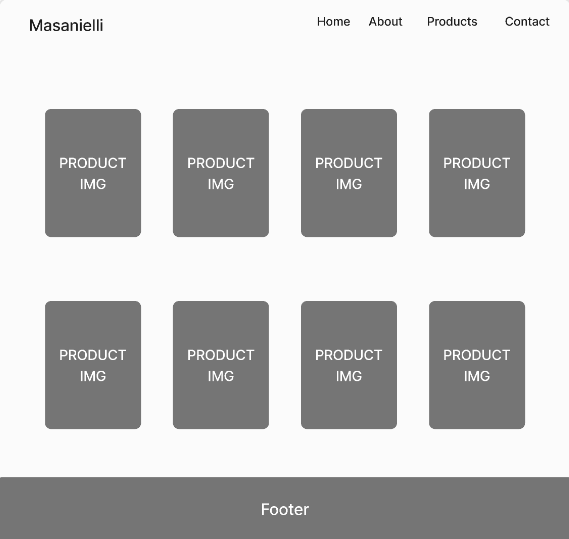
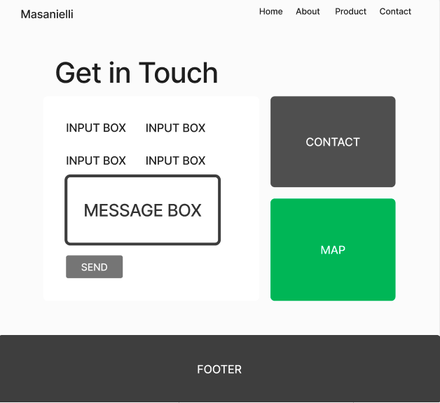
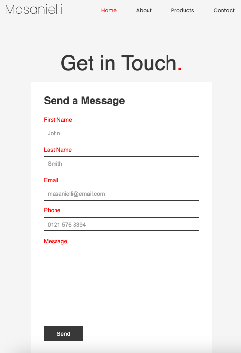
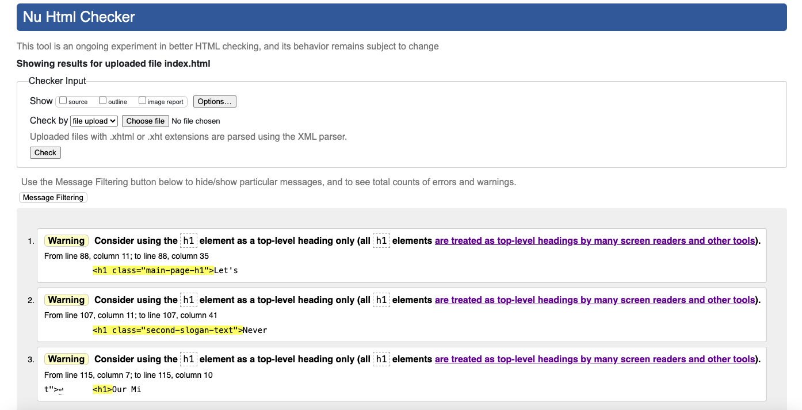
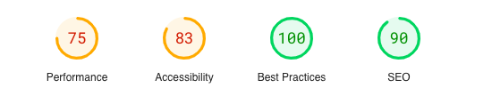
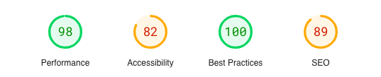
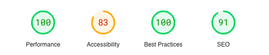

# My First Website

[Visit the live webpage](https://arts-ux.github.io/furniture-store/)

# 1. Project Overview

## 1.1. Project Objective

The primary objective of the project is to showcase handcrafted furniture, customized specifically for each individual that is then made available for purchase. 

The user can browse the selection and then enquire about getting either there own piece made or select from some of the designs alreadly available. The user is left to feel uniquely targted opposed to just buying from any normal retailer.

The target audience are people with a keen eye for detail and appreciation for owning a one of kind artistic piece.

## 1.2. User Stories

### First time users
As a first time visitor I want to know what the website is about.
As a first time visitor I want to know how I can enquire about a product.
As a first time visitor I want to know what the website offers.
As a first time visitor I want to browse what type of products they make to determine if this is right for me.
As a first time visitor I want to check know about social media profiles to see what the company is about and what others have to say.

### Returning users
As a returning visitor I want to see if the company still upholds its reputation.
As a returning visitor I want to see if there are any changes to the services.
As a returning visitor I want to send a message to give a feedback.
As a returning visitor I want to know if there any comminuty links.
Site owner
As a site owner I want to promote my products for the best chance of selling the products.
As a site owner I want to provide more information about custom bespoke furniture and why people should opt to purchase.
As a site owner I want to provide a way for people to get in contact and also share their experience with other potential customers.

## 1.3. Design

The colours I chose to use where neutral off white's and charchoal grey's aswell as a bright vibrant red which pops out from the neutral theme.
I did this as I felt it provided a clean, minimalistic and contempory feel, whils't allowing the beauty of the products to take center stage.

When it came to typography the Poppins font is the main font I used throughout website.
Poppins is a clean font I see throughout web design and this is the primary reason I chose to use it
I combine this with Sans Serif, as I really enjoy the simplicty it has, not only that but in some case where the other font isn't being imported it will not detract from the integrity of the design. 

This minimalist approach was important as to give a proffesional apperance and the images used are a design statement themsleves.
I caught the users eye with a bold typogrpahic company logo aswell as grid style hero layout with images of the products which the user enages with instantly.

I saw this as good design choice as any potential customer will see what is offer as soon as the page loads.

## 1.4. Wireframes

    
Home Page

    

    
Video Section

    

    
About Section

    

    
Footer Section

    

    
Product Page

    

    
Contact Page

    

## 2. Features

The website consists on a main home page with an about section and 3 form pages for the website services (Products/Contact/404 error).

## 2.1. Header & Navigation

The header is displayed across all pages except the 404 error page. It contains a logo to the left, a title and navigation menu. The navigation menu on the home page contains links to all sections in the page.

In mobiles the navigation turns into a drop down with a hamburger menu.

## 2.2. Hero Section

The hero section displays a large version of the company logo as well an artiscally presented array of images showcasing some of the products in a grid-like format. This is so the user gets a visual representaion of what the site offers and at the same time providing a proffesional apperance.

## 2.3. Second Page & Video Section

The second page contains a slogan that has an effect when scrolled to captivate the user and a call to action button that re-directs them to product page.

Upon further scrolling a video of a showroom with furniture is presented which has more to do with aesthics and what a home could look like with these products inside rarther than any other purpose.

## 2.4. About Us Secion

The about us section decribes what it is we do as well a detailed history of the people and the company website.

## 2.5. Footer & Social Media links

The footer containes a link to the homepage of the social media platforms aswell links to homepage, our services, terms and privacy policy. Three of those links are inactive, which when clicked wel re-direct you to the 404 error page where the user can click a link returning you back to the homepage. Currently the the links that users to the home page of the social media still don't have any social media profiles.

The logo image was also added to the footer (which again returns the user back to the homepage).

## 2.6. Product Page

The prodocut pages contains a well laid out structure of images that display each product aswell as the product name, designer and prices.

## 2.7. Contact Form

The Contact form is a page where the user can send the site owner a feedback, how to enquire about a personalized piece or request any aditional information they might potentially need.

 

## 2.8. Error 404 Page

The Error Page contains a 404 message that shows the page they were looking for could not be found and a button which then re-directs them back to the homepage.

# 3. Testing 

## 3.1. HTML Validator

### Home Page

### Product Page

### Contact Page

### 404 Error Page

## 3.2. CSS Validator

For validating the CSS, the style.css file was uploaded to the W3C Jigsaw Validation service. It indicated  no errors and the CSS code passed validation.

## 3.3. Lighthouse

### Homepage

### Product Page

### Contact

### 404 Error

## 3.4. Manual Testing User Stories

| User Story | Testing | Tested | Successful |
| ---------- | ------- | ------ | ----------
| As a first time user I want to know what the website is about | Clicking on the about us navigation link or scrolling down will take the user to the about us section where they will find the relevant information they are looking for | Yes | Yes |
| As a first time user I want to know what products they have on offer | Clicking the products navigation link or scrolling further down just below the hero section the user will find a slogan with a call to action button underneath that, when clicked, will re-direct the user to the product page where they will see a list of 8 products displayed within the page | Yes | Yes |
| As a first time user I want to know how I can enquire about a custom product | Again in the about section, after the description the user will see a red call to action buttton reading 'enquire now'. Upon clicking the link they will then be taken to the contact page where they can submit a detailed request to to company email | Yes | Yes |
| As a first time user I want to check out the company social media profiles | The user can find links to the social media in the footer in any page of the website | Yes | Yes |
| As a first time user I want know how to get in contact with the company| In the navigation menu there is a Contact link that will take the user to the contact page where they can then submit any questions or enquiries they may have | Yes | Yes |
| As a returning user I want to view a range of new products | If the user wants to view any new products in the future they can just click the product link or the view collection button on the main page where they will then be re-directed to the product page that would likely have been updated with new products by the next time they came to visit | Yes | Yes |
| As a returning customer I want to share an interest in further collaborations | Again any link the to the contact page will provide the user the oppurtunity to make such a request | Yes | Yes |
| As a site owner I want to attract people to idea of bespoke one of kind furniture |  This is evident in the about us section as a detailed overview of the what the company do, aswell as a breif history is all laid out in a paragraph on this page | Yes | Yes |
| As a site owner I want to showcase uniquely handcrafted furniture products | This is displayed in the products section as well as landing page as the user is immediately hit with images of this nature | Yes | Yes |
| As a site owner I want to provide users with a way to contact us for any projects, requests or purchases they may have | The user has the option to do this within the contact form inside of the contact page | Yes | Yes |

## 3.5. Bugs and Fixes

Some bugs that were found and fixed:

| **Bug** | **Fix** |
| ------- | ------- |
| Products on product page kept stacking ontop of each other | This was caused by an open 
 tag which was then fixed by adding a closing 
 at the end of the container which then correctly aligned the items in a grid formation |
| Content was overflowing when shrunk down to mobile screen-size | Caused by overflow. This was fixed by adding overflow-x; to the body element in css which then allowed content to stay within the screen without a showing a horizontal scrollbar |
| About us image not loading | Caused by wrong file path. This was fixed by changing the file path to correctly follow the directory structure |
| Map not loading | This was due to a spaceing in the iframe code, this was corrected by removing tab and putting code across one line |

## 4. Deployment

The website was developed using VSCode and deployed through GitHub Pages.
For deploying on GitHub Pages the following actions were taken:

1. Navigate to the repository in GitHub
2. Select the Settings tab
3. On the left navigation menu, under Code and Automation, select Pages
4. Select Deploy from a branch under source
5. Select the main branch
6. After the page reloads, the link to the deployed page then showed up at the top.

You can see the GitHub repository by clicking [here](https://github.com/arts-ux/furniture-store).

## 5. Credits 

## 5.1. Tutorials

The following tutorials were used to create these page elements:

### Navbar

https://www.youtube.com/watch?v=oLgtucwjVII

### Hero Gallery

 https://www.youtube.com/watch?v=Trw_9lisYVY

### Product page 

https://www.youtube.com/watch?v=1CRP_Io2xVA

### Contact Form
https://www.youtube.com/watch?v=KZgMh-CDpa4

## 5.2. Media

The media used in the website:

- [Hero Section Image](assets/images/chair1.jpeg): Photo by: Naro C taken from [Pexels](https://www.pexels.com/photo/21853807/)
- [Hero Section Image](assets/images/chair2.jpeg): Photo by: Naro C taken from [Pexels](https://www.pexels.com/photo/21853816/)
- [Hero Section Image](assets/images/chair10hover.jpeg): Photo by: Naro C taken from [Pexels](https://www.pexels.com/photo/21853825/)
- [Hero Section Image](assets/images/chair11.jpeg): Photo by: Naro C taken from [Pexels](https://www.pexels.com/photo/21853824/)
- [Hero Section Image](assets/images/chair4.jpeg): Photo by: Naro C taken from [Pexels](https://www.pexels.com/photo/21853821/)
- [Hero Section Image](assets/images/chair3.jpeg): Photo by: Naro C taken from [Pexels](https://www.pexels.com/photo/21853808/)

- [About Section Image](assets/images/furniture-maker): Edited from Royalty Free image taken from [Pexels](https://pexels.com/photo/21853829/)

- [Product Page Image](assets/images/chair2.jpeg): Photo by: Naro C taken from [Pexels](https://www.pexels.com/photo/21853816/)
- [Product Page Image](assets/images/chair2hover.jpeg): Photo by: Naro C taken from [Pexels](https://www.pexels.com/photo/21853810/)
- [Product Page Image](assets/images/chair6.jpeg): Photo by: Naro C taken from [Pexels](https://www.pexels.com/photo/21853811/)
- [Product Page Image](assets/images/chair6hover.jpeg): Photo by: Naro C taken from [Pexels](https://www.pexels.com/photo/21853813/)
- [Product Page Image](assets/images/chair7.jpeg): Photo by: Naro C taken from [Pexels](https://www.pexels.com/photo/21853815/)
- [Product Page Image](assets/images/chair7hover.jpeg): Photo by: Naro C taken from [Pexels](https://www.pexels.com/photo/21853826/)

- [Product Page Image](assets/images/chair8.jpeg): Photo by: Naro C taken from [Pexels](https://www.pexels.com/photo/21853818/)
- [Product Page Image](assets/images/chair8hover.jpeg): Photo by: Naro C taken from [Pexels](https://www.pexels.com/photo/21853814/)
- [Product Page Image](assets/images/chair9.jpeg): Photo by: Naro C taken from [Pexels](https://www.pexels.com/photo/21853817/)
- [Product Page Image](assets/images/chair9hover.jpeg): Photo by: Naro C taken from [Pexels](https://www.pexels.com/photo/21853822/)
- [Product Page Image](assets/images/chair10.jpeg): Photo by: Naro C taken from [Pexels](https://www.pexels.com/photo/21853820/)
- [Product Page Image](assets/images/chair10hover.jpeg): Photo by: Naro C taken from [Pexels](https://www.pexels.com/photo/21853816/)
- [Product Page Image](assets/images/chair11.jpeg): Photo by: Naro C taken from [Pexels](https://www.pexels.com/photo/21853823/)
- [Product Page Image](assets/images/chair11hover.jpeg): Photo by: Naro C taken from [Pexels](https://www.pexels.com/photo/21853828/)
- [Product Page Image](assets/images/chair13.jpeg): Photo by: Naro C taken from [Pexels](https://www.pexels.com/photo/21853821/)
- [Product Page Image](assets/images/chair13hover.jpeg): Photo by: Naro C taken from [Pexels](https://www.pexels.com/photo/21853819/)

- [Video Section Video](https://www.pexels.com/video/video-of-a-house-interior-7578554/): Created by [Kindel Media](https://www.pexels.com/video/video-of-a-house-interior-7578554/)